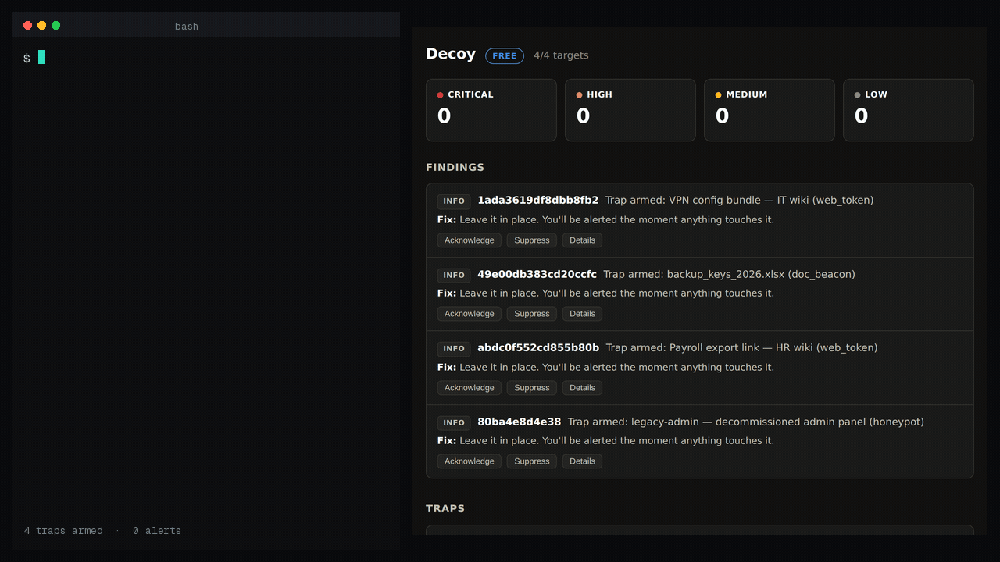

# Decoy

**Self-hosted canary tokens & honeypots — silent until an intruder trips one.**



*Real run: four traps armed on the free tier. One POST to a decommissioned admin panel that nobody
should ever touch — and the alert is on screen before the request finishes, with the username and
password the intruder tried.*

Intruders spend weeks inside before anyone notices. Decoy shrinks that to
seconds. Plant tokens and honeypots that *look valuable* — a "backup keys" link,
a "salaries" spreadsheet, a juicy-looking database port — where only an intruder
would go. A real user never touches them. So when one trips, it's almost never a
false alarm: **someone is in.**

This is deception, not detection-by-signature. You don't hunt the needle in the
haystack; you plant a needle that screams.

- **Web/URL tokens** — unguessable links that alert the instant they're fetched. Plant them anywhere.
- **Document beacons** — a `.docx`/`.xlsx`/`.pdf` that phones home the moment it's opened, with the opener's IP.
- **Honeypot services** — fake SSH/RDP/admin-panel/database ports that log every connection and every credential tried.
- **DNS & cloud-credential traps** — catch scanners that resolve before they connect, and attackers harvesting fake keys (advanced).
- **Alerts with the attacker's fingerprints** — source IP, time, what they touched. Repeated touches from the same trap, the same source IP and the same target inside a 15-minute window fold into one finding and one immediate notification; when that window closes, a second short notification reports how many touches there were. Every trip is still stored as evidence with a count and first/last seen.

> *A vuln scanner asks "is it exploitable?" Decoy answers the question that comes first: "is someone already inside?"*

**Background reading** — [self-hosted deception: where it fits, and where it does not](https://nizartuanku.github.io/thinkst-canary-alternative.html), including an honest comparison with Canarytokens, OpenCanary and Thinkst Canary.

## Plant only in your own systems

Decoy is bait for **your** environment, to catch someone in **your**
environment. It is passive — it records who came, it never attacks back. Please
read [`SAFETY.md`](SAFETY.md) before you start: it's short, and it keeps you on
the right side of the law.

## Self-hosted by design

Runs as a single binary or container on your infrastructure. **Your traps,
trips, and evidence never leave your network.** No telemetry. License validation
is offline cryptography — no phone-home, ever.

## Quick start

```bash
git clone https://github.com/nizartuanku/decoy && cd decoy

# Docker
docker build -t decoy . && docker run -d -p 127.0.0.1:8424:8424 -v decoy-data:/data decoy

# Or the bare binary
go build ./cmd/decoy && ./decoy
```

Open `http://127.0.0.1:8424`, plant a trap, copy its link into somewhere only an
intruder would look, and wait. See [`INSTALL`](#install) notes below for the
base-URL and honeypot placement details.

## Editions

| | Free (this repo) | Pro | Team |
|---|---|---|---|
| Web/URL tokens | 3 | 50 | Unlimited |
| Document beacons | ✅ | ✅ | ✅ |
| Honeypot listeners | 1 | 10 | Unlimited |
| DNS / cloud-credential traps | — | ✅ | ✅ |
| Alert channels | Webhook, syslog | + Email, Slack, Telegram | + PagerDuty, MS Teams |
| Trip history | 14 days | 1 year | Unlimited |
| Support | Community | Email | Priority |

**Whop sells paid licences only.** Free: github.com/nizartuanku/decoy — this repository is the free edition, Apache-2.0, no time limit; nothing on Whop is free, so try it here first.

Pro ($29/mo) and Team ($99/mo) licenses, each with a 14-day free trial:
**https://whop.com/nizar-tuanku/decoy-canary-honeypots?utm_source=github**

A license key activates instantly and validates **offline** — Decoy never needs
to reach our servers. An expired key never disarms your traps; it simply returns
to free limits.

## Install

- **Base URL** — a web token/document beacon is a URL; whoever opens it must be
  able to reach Decoy. Set `-base-url https://decoy.example.com` (behind a
  reverse proxy/TLS) or an internal address. Only the `/t/...` token path needs
  to be publicly reachable — keep the dashboard private.
- **Honeypots** — bind where scans land (`-honeypot-bind`, default all
  interfaces), on ports that are free on that host.
- **DNS tokens** — need a delegated zone: `sudo ./decoy -dns-zone canary.example.com -dns-listen :53`.

## Working with the other Hexward tools

Every tool in the line can emit its findings as syslog, which is how they feed
each other:

```bash
decoy -syslog loglight.internal:5514        # udp by default
decoy -syslog loglight.internal:5514 -syslog-network tcp
```

One RFC 3164 frame per finding, severity mapped onto the syslog severity so
your collector's existing routing rules still work, and the source address
carried in `src=` when the finding has one.

Point it at [Loglight](https://github.com/nizartuanku/loglight) and its findings
land next to Loglight's own detections: a Decoy trip from an address Loglight
already saw port-scanning is raised as one critical incident with the timeline
attached, rather than two alerts you have to join up yourself. Any other syslog
collector works too — there is nothing Hexward-specific about the format.

Available on every tier, free included.

## AI Assist (optional)

Decoy can explain a finding in plain language with a small language model that runs on
your own hardware. It is off by default. Turn it on by starting a
[hexward-ai](https://github.com/nizartuanku/hexward-ai) sidecar and pointing Decoy at it:

```sh
decoy -ai-assist-url http://127.0.0.1:8435
```

Each finding then gets an **✨ Explain** button. The model writes what the finding means and
what to verify before you act. It also gets a fixed disclaimer.

- **The engine still decides.** The model receives one finding after Decoy has produced it.
  It cannot add, remove, re-score or close a finding. If the sidecar is off, slow or broken,
  the button shows a short note and nothing else changes.
- **What leaves the process.** One finding: its check, title, target, severity, status,
  remediation and a sanitised copy of its evidence. Keys that look like secrets (password,
  token, secret, private, credential, cookie, session, signature and similar) are dropped
  first. Nothing goes to the internet. The sidecar runs where you run it.
- **Editions.** The free edition works with a sidecar on the same host. That is the `lab`
  profile, SmolLM3-3B. Pro and Team can also use one dedicated AI host for several products,
  or your own OpenAI-compatible endpoint, through `-ai-assist-key-file`. The recommended
  profile there is `smb` (Phi-4-mini-instruct). Enterprise uses Qwen3 or your own endpoint.
- **Language.** English is the supported language in this release. `-ai-assist-lang id`
  (Bahasa Indonesia) remains as an unsupported preview. More languages will be added based on
  demand.
- **Honest limit.** Small local models sometimes add general background that is not in the
  evidence. For example, they may name a well-known attack, and that background can be wrong.
  Treat the explanation as a starting point. The finding, its evidence and its fix text remain
  the record, which is why every explanation carries the "verify against raw findings" line.
- **Speed.** On a CPU-only machine an explanation takes about 15–50 seconds, depending on the
  model. Measurements are in hexward-ai's `docs/TIERS.md`.

Environment equivalents: `DECOY_AI_ASSIST_URL`, `DECOY_AI_ASSIST_KEY_FILE`,
`DECOY_AI_ASSIST_LANG`, `DECOY_AI_ASSIST_NO_THINKING=1`.

## Honest limits

- Decoy is **detection by deception, not prevention** — it tells you someone's
  in; it doesn't keep them out. Pair it with your controls.
- Coverage equals placement — a trap only fires if an intruder finds it. The
  user guide includes a seeding playbook.
- Document beacons fire only in clients that fetch remote content (many, not all).
- Honeypots see only connections that reach them.
- DNS tokens and full cloud-credential-misuse detection need external setup
  (delegated zone; AWS CloudTrail) — documented, never silently assumed.
- Not a replacement for EDR/SIEM; a high-signal complement.

## Built by

Nizar Tuanku — Cybersecurity. Part of the Hexward line of
self-hosted security tools. Watch your certs with
[CertLight](https://whop.com/nizar-tuanku/certlight-tls-monitor?utm_source=github) and your
perimeter with [Attack Surface Monitor](https://whop.com/nizar-tuanku/attack-surface-monitor?utm_source=github) —
Decoy watches for the intruder who's already past both.
